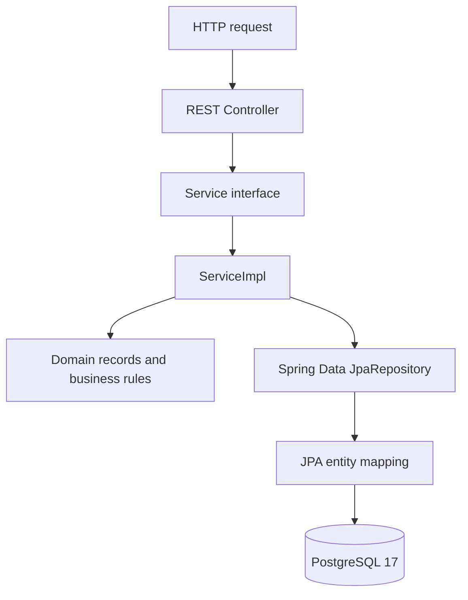
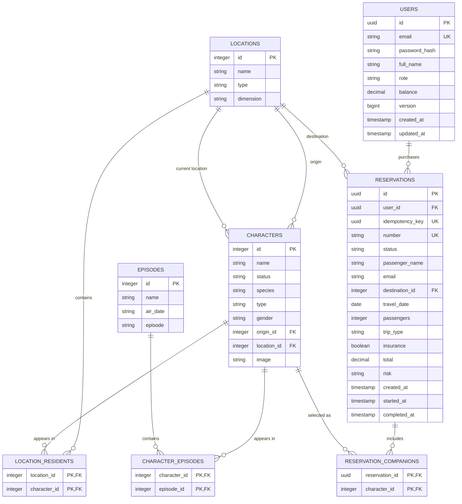
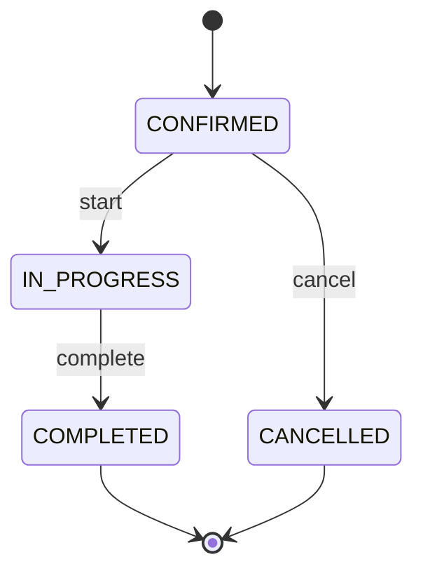

# PortalTrip API (`portaltrip`)


[](https://prgm-code.github.io/portaltrip/)


**PortalTrip API** is a REST service built with **Java 26** and **Spring Boot 4.1.1**. It stores the Rick and Morty catalog in PostgreSQL and manages authenticated travelers, a simple credit balance, server-side quotes and user-owned interdimensional reservations.

The application follows the same service pattern as NeonPulse. Controllers depend on service interfaces, `ServiceImpl` classes coordinate each use case and access Spring Data JPA repositories directly. Domain records own their invariants and state transition rules. Spring Security keeps the catalog public, issues HS256 access tokens and scopes reservations to the authenticated user.

[Open the visual system report](https://iy01azmjp64c.postplan.dev)

---

## Project structure and architecture

```text
portaltrip/
├── pom.xml                                            # Maven, Spring Boot and JaCoCo
├── compose.yml                                        # PostgreSQL 17 and seed mounts
├── .env.example                                       # Local environment template
├── bruno/                                             # Executable REST contract collection
├── db/
│   ├── seed.sql                                       # Rick and Morty catalog
│   └── app-schema.sql                                 # Users, reservations and companions
└── src/
    ├── main/
    │   ├── java/cl/prgm/portaltrip/
    │   │   ├── PortaltripApplication.java             # Spring Boot entry point
    │   │   ├── ServletInitializer.java                # WAR deployment initializer
    │   │   │
    │   │   ├── domain/                                # Domain rules and models
    │   │   │   ├── model/
    │   │   │   │   ├── Character.java                # Character domain record
    │   │   │   │   ├── Episode.java                  # Episode domain record
    │   │   │   │   ├── Location.java                 # Location and insurance rule
    │   │   │   │   ├── Quote.java                    # Calculated price breakdown
    │   │   │   │   ├── Reservation.java              # Aggregate, ownership and transitions
    │   │   │   │   ├── ReservationBalanceResult.java # Reservation plus remaining credits
    │   │   │   │   ├── ReservationDraft.java         # Self-validating creation input
    │   │   │   │   ├── ReservationStatus.java        # Reservation lifecycle states
    │   │   │   │   ├── RiskLevel.java                # LOW, MEDIUM and HIGH
    │   │   │   │   ├── TripType.java                 # Trip type and price multiplier
    │   │   │   │   └── UserAccount.java              # Credentials, role and credit balance
    │   │   │   ├── service/
    │   │   │   │   └── QuoteCalculator.java          # Quote and risk rules
    │   │   │   └── exception/
    │   │   │       ├── DomainValidationException.java
    │   │   │       ├── DuplicateUserException.java
    │   │   │       ├── IdempotencyConflictException.java
    │   │   │       ├── InsufficientBalanceException.java
    │   │   │       ├── InvalidCredentialsException.java
    │   │   │       ├── InvalidReservationStateException.java
    │   │   │       └── ResourceNotFoundException.java
    │   │   │
    │   │   ├── application/service/                  # Service interfaces and use cases
    │   │   │   ├── AuthResult.java
    │   │   │   ├── AuthService.java
    │   │   │   ├── AuthServiceImpl.java
    │   │   │   ├── CharacterService.java
    │   │   │   ├── CharacterServiceImpl.java
    │   │   │   ├── EpisodeService.java
    │   │   │   ├── EpisodeServiceImpl.java
    │   │   │   ├── LocationService.java
    │   │   │   ├── LocationServiceImpl.java
    │   │   │   ├── QuoteQuery.java
    │   │   │   ├── QuoteService.java
    │   │   │   ├── QuoteServiceImpl.java
    │   │   │   ├── ReservationService.java
    │   │   │   ├── ReservationServiceImpl.java
    │   │   │   ├── UserService.java
    │   │   │   └── UserServiceImpl.java
    │   │   │
    │   │   └── infrastructure/
    │   │       ├── persistence/                      # JPA entities and repositories
    │   │       │   ├── CharacterEntity.java
    │   │       │   ├── EpisodeEntity.java
    │   │       │   ├── LocationEntity.java
    │   │       │   ├── ReservationEntity.java
    │   │       │   ├── UserEntity.java
    │   │       │   └── repository/
    │   │       │       ├── CharacterJpaRepository.java
    │   │       │       ├── EpisodeJpaRepository.java
    │   │       │       ├── LocationJpaRepository.java
    │   │       │       ├── ReservationJpaRepository.java
    │   │       │       └── UserJpaRepository.java
    │   │       ├── security/                         # JWT, CORS and HTTP security
    │   │       │   ├── JwtTokenService.java          # HS256 access-token issuer
    │   │       │   ├── PortalTripUserDetailsService.java
    │   │       │   ├── RestAccessDeniedHandler.java
    │   │       │   ├── RestAuthenticationEntryPoint.java
    │   │       │   └── SecurityConfig.java           # Public catalog vs authenticated wallet
    │   │       └── web/                              # REST controllers and DTOs
    │   │           ├── config/OpenApiConfig.java
    │   │           ├── controller/
    │   │           │   ├── AuthController.java
    │   │           │   ├── CharacterController.java
    │   │           │   ├── EpisodeController.java
    │   │           │   ├── HomeController.java
    │   │           │   ├── LocationController.java
    │   │           │   ├── QuoteController.java
    │   │           │   ├── ReservationController.java
    │   │           │   └── UserController.java
    │   │           ├── dto/                          # HTTP request and response records
    │   │           └── exception/GlobalExceptionHandler.java
    │   └── resources/
    │       ├── application.yaml                      # Safe defaults and JWT settings
    │       ├── application-dev.yaml                  # PostgreSQL, JPA and enabled OpenAPI
    │       ├── application-prod.yaml                 # Validated schema and disabled OpenAPI
    │       └── static/index.html                     # Welcome page
    └── test/java/cl/prgm/portaltrip/                 # 172 automated tests
        ├── AuthenticationFlowIntegrationTest.java    # Register, login, JWT, CORS, 401 and 403
        ├── domain/                                   # Model, exception and quote-rule tests
        ├── application/service/                      # Service tests with mocked JPA repositories
        └── infrastructure/
            ├── persistence/                          # Entity mapping and user-scoped queries
            ├── security/                             # JWT issue/decode and UserDetails
            └── web/                                  # Controller, DTO, OpenAPI and errors
```

### Request and persistence flow



`ServiceImpl` is the point where both sides meet. It uses domain objects to make business decisions and JPA repositories to load or store data. The controllers never access JPA, and the domain does not import Spring or Jakarta Persistence.

---

## Relational database model and table references

The catalog contains 826 characters, 126 locations and 51 episodes. Docker loads it once from `db/seed.sql`. The application then creates reservations against that catalog through the schema in `db/app-schema.sql`.



### Foreign keys

1. `characters.origin_id` references `locations.id`.
2. `characters.location_id` references `locations.id`.
3. `location_residents` joins locations and their last known residents.
4. `character_episodes` joins characters and episodes.
5. `reservations.user_id` references `users.id`.
6. `reservations.destination_id` references `locations.id`.
7. `reservation_companions` joins reservations and selected characters.

---

## Environment variables and Docker setup

Copy the example configuration before starting the application:

```bash
cp .env.example .env
```

| Variable | Description | Local default |
| :--- | :--- | :--- |
| `SPRING_PROFILES_ACTIVE` | Spring profile (`dev` enables Swagger, `prod` disables it) | `dev` |
| `SERVER_PORT` | Spring Boot HTTP port | `8080` |
| `DB_HOST` | PostgreSQL hostname | `localhost` |
| `DB_PORT` | PostgreSQL port | `5432` |
| `DB_NAME` | PostgreSQL database | `rickandmorty` |
| `DB_USER` | PostgreSQL user | `rick` |
| `DB_PASSWORD` | PostgreSQL password | `morty` |
| `JWT_SECRET_BASE64` | Base64 HMAC secret; required and at least 32 decoded bytes | none |
| `JWT_TTL` | Access-token lifetime | `PT30M` |
| `JWT_ISSUER` | Expected JWT issuer | `https://portaltrip.local` |
| `JWT_AUDIENCE` | Expected JWT audience | `portaltrip-api` |
| `REGISTRATION_CREDIT` | Credits granted to a new account | `5000.00` |
| `APP_CORS_ALLOWED_ORIGINS` | Comma-separated frontend origins | `http://localhost:4321,http://127.0.0.1:4321` |

Generate a local signing key once and place the result in `.env`:

```bash
openssl rand -base64 32
```

Start or stop the API and PostgreSQL with Docker Compose:

```bash
# Build Spring Boot, start the API and initialize PostgreSQL
docker compose up -d --build

# Stop the container without deleting its data
docker compose down
```

Compose exposes the API at `http://localhost:8080`. The stack defaults to the `dev`
profile, so Swagger UI is available at `http://localhost:8080/swagger-ui.html`.
PostgreSQL stays on the internal Compose network, and Spring Boot connects to it
with the hostname `postgres`.

To run the same stack without documentation endpoints:

```bash
SPRING_PROFILES_ACTIVE=prod docker compose up -d --build
```

The official PostgreSQL image runs these files only when it creates the data volume:

```text
db/seed.sql        -> /docker-entrypoint-initdb.d/01-seed.sql
db/app-schema.sql  -> /docker-entrypoint-initdb.d/02-app-schema.sql
```

To recreate the database from scratch, run `docker compose down -v && docker compose up -d`. This deletes existing users and reservations as well as the catalog volume.

---

## How to run the application

```bash
# Start PostgreSQL
docker compose up -d

# Run PortalTrip with the Maven wrapper
./mvnw spring-boot:run
```

The application starts at `http://localhost:8080`. `JWT_SECRET_BASE64` must be present in the environment when the application starts outside the test profile.

- Swagger UI: `http://localhost:8080/swagger-ui.html`
- OpenAPI JSON: `http://localhost:8080/api-docs`
- Healthcheck: `http://localhost:8080/health`

The default local profile is `dev`; it enables Swagger UI and OpenAPI. Production requires explicit database variables, validates the existing schema and disables both documentation endpoints:

```bash
SPRING_PROFILES_ACTIVE=prod \
DB_HOST=localhost DB_PORT=5432 DB_NAME=rickandmorty \
DB_USER=rick DB_PASSWORD=morty \
JWT_SECRET_BASE64='replace-with-a-generated-secret' \
./mvnw spring-boot:run
```

---

## Testing and JaCoCo coverage

The suite contains **172 tests**. Maven generates the console and HTML reports during `test`, and enforces 100% instruction and branch coverage during `verify`.

```bash
# Run tests
./mvnw clean test

# Run tests and enforce the coverage thresholds
./mvnw clean verify
```

The HTML report is generated at:

```text
target/site/jacoco/index.html
```

**[Open the JaCoCo report published by GitHub Actions](https://prgm-code.github.io/portaltrip/)**

Current verified coverage:

| Counter | Covered | Result |
| :--- | ---: | :--- |
| Instructions | 3669 / 3669 | 100% |
| Branches | 120 / 120 | 100% |
| Lines | 767 / 767 | 100% |
| Methods | 235 / 235 | 100% |

GitHub Actions executes `./mvnw -B clean verify` on pull requests and pushes to `main`. It retains the Surefire and JaCoCo artifacts for 14 days and publishes the successful `main` report with GitHub Pages.

---

## REST API documentation

Catalog and quote endpoints are public. Registration and login are public. Profile and reservation endpoints require `Authorization: Bearer <token>`.

Every `/api/v1` endpoint returns the same response envelope:

```json
{
  "status": 200,
  "message": "Quote calculated successfully",
  "data": {},
  "timestamp": "2026-08-30T22:49:00Z"
}
```

### Catalog endpoints

| Method | Endpoint | Description | Status codes |
| :--- | :--- | :--- | :--- |
| `GET` | `/api/v1/locations` | List location summaries | `200 OK` |
| `GET` | `/api/v1/locations/{id}` | Get a location with resident IDs | `200 OK`, `400 Bad Request`, `404 Not Found` |
| `GET` | `/api/v1/characters` | List character summaries | `200 OK` |
| `GET` | `/api/v1/characters/{id}` | Get a character with episode IDs | `200 OK`, `400 Bad Request`, `404 Not Found` |
| `GET` | `/api/v1/episodes` | List episode summaries | `200 OK` |
| `GET` | `/api/v1/episodes/{id}` | Get an episode with character IDs | `200 OK`, `400 Bad Request`, `404 Not Found` |

### Quote endpoint

| Method | Endpoint | Description | Status codes |
| :--- | :--- | :--- | :--- |
| `POST` | `/api/v1/quotes` | Calculate price and risk without persisting data | `200 OK`, `400 Bad Request`, `404 Not Found` |

Example request:

```json
{
  "destinationId": 3,
  "passengers": 2,
  "tripType": "exploration",
  "insurance": false
}
```

Example response data:

```json
{
  "basePrice": 1200,
  "locationSurcharge": 300,
  "passengerSurcharge": 216,
  "tripSurcharge": 360,
  "insuranceCost": 380,
  "total": 2456,
  "risk": "MEDIUM"
}
```

### Reservation endpoints

All reservation endpoints require `Authorization: Bearer <token>`. Creation also requires a UUID in `Idempotency-Key`, so retrying the same request cannot charge the balance twice.

| Method | Endpoint | Description | Status codes |
| :--- | :--- | :--- | :--- |
| `POST` | `/api/v1/reservations` | Validate, charge and create a confirmed reservation | `201 Created`, `400 Bad Request`, `404 Not Found`, `409 Conflict`, `422 Unprocessable Entity` |
| `GET` | `/api/v1/reservations` | List reservations from newest to oldest | `200 OK` |
| `GET` | `/api/v1/reservations/{id}` | Get reservation detail | `200 OK`, `400 Bad Request`, `404 Not Found` |
| `PATCH` | `/api/v1/reservations/{id}/start` | Move `CONFIRMED` to `IN_PROGRESS` | `200 OK`, `404 Not Found`, `409 Conflict` |
| `PATCH` | `/api/v1/reservations/{id}/complete` | Move `IN_PROGRESS` to `COMPLETED` | `200 OK`, `404 Not Found`, `409 Conflict` |
| `PATCH` | `/api/v1/reservations/{id}/cancel` | Cancel and refund a confirmed reservation | `200 OK`, `404 Not Found`, `409 Conflict` |

Example creation request:

```json
{
  "passengerName": "Morty Smith",
  "destinationId": 1,
  "travelDate": "2099-12-20",
  "passengers": 2,
  "companionIds": [1, 2],
  "tripType": "exploration",
  "insurance": true,
  "comments": "Window seat"
}
```

Creation and cancellation responses wrap the reservation together with `remainingBalance`, allowing the frontend to refresh its balance immediately.

### Authentication and user endpoints

| Method | Endpoint | Description | Authentication |
| :--- | :--- | :--- | :--- |
| `POST` | `/api/v1/auth/register` | Create an account, grant the initial credit and return a JWT | Public |
| `POST` | `/api/v1/auth/login` | Validate credentials and return a JWT | Public |
| `GET` | `/api/v1/users/me` | Return the current user and database-backed balance | Bearer JWT |

Passwords use Spring Security's delegating password encoder with BCrypt. HS256 access tokens expire after 30 minutes by default and validate signature, expiration, issuer and audience. The signing secret has no fallback in the repository.

### Error handling

| Scenario | HTTP status | Response message |
| :--- | :--- | :--- |
| Resource not found | `404 Not Found` | Identifies the missing resource and ID |
| Invalid HTTP input | `400 Bad Request` | Lists invalid fields and validation messages |
| Domain rule violation | `422 Unprocessable Entity` | Returns `Validation failed` and the domain errors in `data` |
| Invalid state transition | `409 Conflict` | Identifies the current and requested reservation states |
| Duplicate account or conflicting idempotency key | `409 Conflict` | Explains the conflict without exposing credentials |
| Invalid or absent authentication | `401 Unauthorized` | Returns the unified JSON response envelope |
| Insufficient balance | `422 Unprocessable Entity` | Returns required and current credit values |
| Unexpected server error | `500 Internal Server Error` | Returns a generic message and logs the exception server-side |

---

## Business rules

### Quote calculation

| Concept | Rule |
| :--- | :--- |
| Base price | 1200 credits |
| Trip type | `express` x1, `exploration` x1.3, `premium` x1.65 |
| Extra passengers | 18% of the base price per additional passenger |
| Space station | 25% surcharge when the location type contains `station` |
| Insurance | 190 credits per passenger, mandatory for an unknown dimension |
| Risk | `HIGH` with no residents, `MEDIUM` for an unknown dimension or fewer than five residents, `LOW` otherwise |

### Reservation validation

- `ReservationRequestDto` validates the HTTP request with Jakarta Validation.
- `ReservationDraft` checks its field invariants when constructed.
- `Reservation.confirm` checks companion status and destination insurance before creating the aggregate.
- `ReservationServiceImpl` verifies that every requested companion exists, then coordinates domain validation, quote calculation and persistence.
- The passenger email comes from the authenticated account, never from the reservation request.
- Creating a reservation locks the user row, checks idempotency and debits the quote total atomically.
- Cancelling a confirmed reservation restores that total atomically. This concept API intentionally has no credit-history model.

### Reservation lifecycle



`COMPLETED` and `CANCELLED` are terminal states. An invalid transition returns `409 Conflict`.

---

## cURL testing guide

```bash
# 1. Healthcheck
curl -i http://localhost:8080/health

# 2. List locations
curl -i http://localhost:8080/api/v1/locations

# 3. Get location detail
curl -i http://localhost:8080/api/v1/locations/3

# 4. Calculate a quote
curl -i -X POST http://localhost:8080/api/v1/quotes \
  -H "Content-Type: application/json" \
  -d '{
    "destinationId": 3,
    "passengers": 2,
    "tripType": "exploration",
    "insurance": false
  }'

# 5. Register and copy data.accessToken from the response
curl -i -X POST http://localhost:8080/api/v1/auth/register \
  -H "Content-Type: application/json" \
  -d '{
    "fullName": "Morty Smith",
    "email": "morty@example.com",
    "password": "portal-gun-123"
  }'

# 6. Log in if the account already exists
curl -i -X POST http://localhost:8080/api/v1/auth/login \
  -H "Content-Type: application/json" \
  -d '{
    "email": "morty@example.com",
    "password": "portal-gun-123"
  }'

# 7. Create a reservation
curl -i -X POST http://localhost:8080/api/v1/reservations \
  -H "Authorization: Bearer ${ACCESS_TOKEN}" \
  -H "Idempotency-Key: 58f13289-82e8-4e67-a196-8b8ef445c978" \
  -H "Content-Type: application/json" \
  -d '{
    "passengerName": "Morty Smith",
    "destinationId": 1,
    "travelDate": "2099-12-20",
    "passengers": 2,
    "companionIds": [1, 2],
    "tripType": "exploration",
    "insurance": true,
    "comments": "Window seat"
  }'

# 8. Read the current balance
curl -i http://localhost:8080/api/v1/users/me \
  -H "Authorization: Bearer ${ACCESS_TOKEN}"

# 9. Cancel and refund a confirmed reservation
curl -i -X PATCH http://localhost:8080/api/v1/reservations/{id}/cancel \
  -H "Authorization: Bearer ${ACCESS_TOKEN}"
```

---

## Bruno contract collection

Open the `bruno/` directory in Bruno, select the `local` environment and run the collection in sequence. Register creates a unique email so the run does not depend on an empty `users` table. The collection then logs in, reads `/users/me`, charges a reservation, lists it, refunds a second confirmed booking, completes the first trip and checks that a completed reservation cannot be cancelled.

| Seq | File | What it checks |
| :--- | :--- | :--- |
| 1 | `01-healthcheck.bru` | `GET /health` |
| 2 | `02-list-locations.bru` | Public catalog |
| 3 | `03-calculate-quote.bru` | Public quote |
| 4 | `04-register.bru` | Account, initial `5000` credits and JWT |
| 5 | `05-login.bru` | Email/password login replaces the token |
| 6 | `06-get-profile.bru` | Bearer `/users/me` |
| 7 | `07-create-reservation.bru` | Authenticated charge with `Idempotency-Key` |
| 8 | `08-get-reservation.bru` | Owner-scoped detail |
| 9 | `09-list-reservations.bru` | Owner-scoped list |
| 10 | `10-create-refund-reservation.bru` | Second confirmed booking |
| 11 | `11-cancel-reservation.bru` | Cancel restores the balance from step 7 |
| 12 | `12-start-reservation.bru` | `CONFIRMED` to `IN_PROGRESS` |
| 13 | `13-complete-reservation.bru` | `IN_PROGRESS` to `COMPLETED` |
| 14 | `14-reject-terminal-cancel.bru` | `409 Conflict` on a completed trip |

The same audit can be run from the CLI while the application is listening on port 8080:

```bash
cd bruno
bru run --env-file environments/local.bru --bail
```

---

## Logging

PortalTrip uses Spring Boot's default SLF4J and Logback configuration. Normal application output goes to the console at `INFO` level.

`GlobalExceptionHandler` logs unexpected exceptions with their stack traces and returns `Internal server error` to the client. Expected `400`, `404`, `409` and `422` responses are not logged as server failures.

Package-specific levels can be configured in `src/main/resources/application.yaml`:

```yaml
logging:
  level:
    root: INFO
    cl.prgm.portaltrip: DEBUG
```

---
